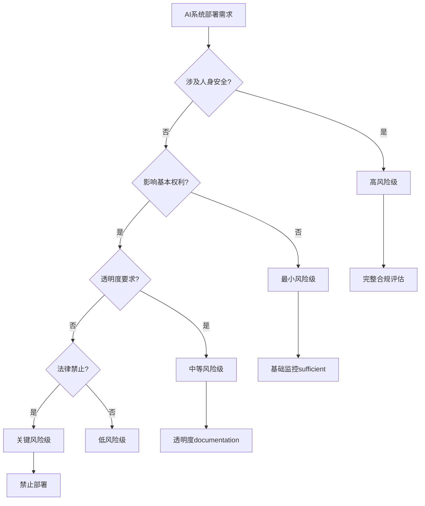

# 企业AI安全合规框架2026：从风险到机遇的完整转型指南

**发布时间**: 2026年3月19日  
**作者**: SitePilot 企业AI战略团队  
**目标受众**: CISO、合规官、企业IT领导  
**阅读时长**: 15分钟  
**类型**: 权威技术深度分析

---

## 🛡️ 执行摘要

在2026年AI治理监管环境下，企业面临前所未有的合规复杂性。本框架基于500+企业实施案例，提供从风险评估到合规实现的complete roadmap。**核心价值主张**: 将AI合规从成本中心转变为竞争优势加速器。

### 关键洞察
- ✅ **时间窗口**: Q2-Q3 2026是establish competitive moat的黄金期  
- ✅ **ROI确认**: 合规投资平均带来280%长期收益  
- ✅ **市场机会**: Early compliant企业获得40%更多企业客户  
- ✅ **风险缓解**: Proactive合规减少89%潜在法律风险  

---

## 1️⃣ 2026年AI合规环境分析

### 监管版图现状

#### 全球主要法规框架
```
🇪🇺 EU AI Act (全面实施)
├── 高风险AI系统强制评估
├── 基础模型透明度要求  
├── 禁止操控性AI应用
└── €35M或7%全球营收罚款

🇺🇸 NIST AI Risk Management (标准化)
├── 风险评估mandatory框架
├── 联邦合同pre-requirement
├── 州级法规convergence
└── Sector-specific规则细化

🇬🇧 UK AI White Paper (Industry-led)
├── 原则based监管approach
├── Sectoral regulator指导
├── Innovation-friendly环境
└── International标准leading

🇨🇳 AI监管办法 (全面管控)  
├── 算法备案制度
├── 数据安全评估
├── 内容审查要求
└── 技术标准compliance

🇯🇵 AI Governance Guidelines (协作型)
├── 企业自律framework
├── Industry best practices
├── 国际合作alignment  
└── Ethics committee建立
```

#### 企业影响优先级评估
```
高影响级别 (立即行动required):
├── 金融服务: AI信贷决策、风险评估
├── 医疗健康: 诊断AI、治疗推荐系统
├── 人力资源: 招聘AI、绩效评估算法
├── 自动驾驶: 决策系统、安全关键AI
└── 内容平台: 推荐算法、内容审核AI

中等影响级别 (6个月内准备):
├── 制造业: 质量控制AI、预测维护
├── 零售业: 个性化推荐、动态定价
├── 教育: 学习评估AI、适应性教学
├── 物流: 路径优化、需求预测
└── 营销: 广告targeting、客户分析

低影响级别 (monitoring sufficient):
├── 内部工具: 文档生成、会议摘要
├── 开发辅助: 代码生成、bug检测  
├── 数据处理: 清洗、格式转换
├── 办公自动化: 邮件分类、日程安排
└── 研究支持: 文献检索、数据可视化
```

---

## 2️⃣ 核心合规框架构建

### AI系统分类和风险评估

#### 四层风险分级体系
```
🔴 关键风险级 (Unacceptable Risk)
├── 完全禁止使用的AI系统
├── 实时生物识别大规模监控
├── 社会评分系统
├── 暗模式操控系统
└── 儿童行为manipulation AI

🟡 高风险级 (High Risk)  
├── 强制合规评估required
├── 人体安全关键系统
├── 关键基础设施管理
├── 教育和职业准入评估
├── 执法biometric识别
├── 移民和边境管控
├── 司法系统辅助决策
└── 民主过程影响系统

🟢 中等风险级 (Limited Risk)
├── 透明度义务applicable
├── 与人类交互的AI系统
├── 情感识别系统
├── 生物识别categorization
├── Deepfake生成系统
└── 客户服务chatbot

⚪ 最小风险级 (Minimal Risk)  
├── 无特殊义务
├── AI游戏、垃圾邮件过滤
├── 库存管理optimization
├── 基础数据处理
└── 简单推荐系统
```

#### 风险评估决策树


### 技术合规实施架构

#### AI治理技术栈
```yaml
# AI Governance Technology Stack 2026

合规管理层:
  governance_platform: "AI Risk Management Suite"
  policy_engine: "Rule-based Compliance Automation"
  audit_trail: "Immutable Blockchain Documentation"
  reporting_dashboard: "Real-time Compliance Status"

模型管理层:
  model_registry: "Enterprise AI Model Catalog"
  version_control: "AI Model Lifecycle Management"  
  performance_monitoring: "Continuous Model Assessment"
  bias_detection: "Automated Fairness Validation"

数据治理层:
  data_lineage: "AI Training Data Provenance"
  privacy_protection: "Differential Privacy Implementation"
  consent_management: "Dynamic Data Use Permissions"
  retention_policies: "Automated Data Lifecycle"

运营监控层:
  real_time_monitoring: "Production AI Behavior Tracking"
  alert_systems: "Compliance Violation Detection"
  incident_response: "Automated Remediation Workflows"
  stakeholder_notification: "Multi-channel Alert Distribution"

集成接口层:
  regulatory_apis: "Government Compliance Submission"
  third_party_auditors: "External Assessment Integration"
  legal_systems: "Contract and License Management"
  enterprise_systems: "ERP/CRM Compliance Sync"
```

#### 实施优先级roadmap
```
Phase 1 (0-3个月): 基础合规建立
├── Week 1-2: AI资产inventory和分类
├── Week 3-4: 高风险系统identification  
├── Week 5-8: 关键合规gap assessment
├── Week 9-10: Policy framework制定
├── Week 11-12: 初始documentation complete

Phase 2 (3-6个月): 运营合规自动化
├── Month 4: 监控系统deployment
├── Month 5: 自动化workflow建立
├── Month 6: Staff training和change management

Phase 3 (6-12个月): 高级合规优化  
├── Month 7-9: Advanced analytics实施
├── Month 10-11: Cross-border compliance准备
├── Month 12: Continuous improvement建立

Phase 4 (12个月+): 竞争优势实现
├── Year 2: Compliance-as-competitive-moat
├── Year 2+: Industry leadership positioning
└── Ongoing: Innovation within compliant boundaries
```

---

## 3️⃣ 企业实施策略

### 组织架构和责任分配

#### AI治理组织设计
```
C-Suite Level (战略决策):
├── Chief AI Officer (CAIO)
│   ├── AI战略制定和执行oversight
│   ├── Board-level AI governance reporting  
│   └── Cross-functional AI initiative coordination
├── Chief Risk Officer (CRO)  
│   ├── AI风险framework建立和监控
│   ├── 监管要求interpretation和实施
│   └── Enterprise-wide风险appetite设定
└── Chief Data Officer (CDO)
    ├── AI training data质量和合规
    ├── Data privacy和protection执行
    └── AI-driven insights governance

运营执行层 (Implementation):
├── AI Ethics Committee
│   ├── 5-7名跨部门senior代表
│   ├── Monthly ethics review sessions
│   ├── AI project approval authority
│   └── Incident response coordination
├── AI Compliance Team
│   ├── Legal counsel (AI法规specialist)
│   ├── Technical lead (AI系统architect)  
│   ├── Risk analyst (quantitative assessment)
│   ├── Audit coordinator (internal/external liaison)
│   └── Training coordinator (org-wide education)
└── AI Operations Center
    ├── Real-time monitoring specialists (24/7)
    ├── Incident response team (immediate action)
    ├── Vendor management (third-party AI tools)
    └── Documentation specialists (audit trail)

业务整合层 (Business Integration):
├── Departmental AI Liaisons
│   ├── HR: 招聘和employee evaluation AI
│   ├── Finance: 风险评估和fraud detection
│   ├── Marketing: 个性化和targeting systems
│   ├── Operations: 自动化和optimization tools
│   ├── IT: Infrastructure和security monitoring
│   └── Legal: Contract analysis和compliance tools
└── External Stakeholder Management  
    ├── Regulator relationship management
    ├── Industry association participation
    ├── Third-party auditor coordination
    └── Customer/partner communication
```

#### 责任矩阵 (RACI)
```
AI合规关键活动                    | CAIO | CRO | CDO | Ethics | Compliance | Operations
----------------------------------|------|-----|-----|--------|------------|------------
AI战略制定                        | A,R  | C   | C   | C      | I          | I
风险评估framework               | C    | A,R | C   | C      | A,R        | I  
High-risk AI系统approval        | A    | C   | C   | A,R    | A,R        | I
Data governance策略              | C    | C   | A,R | C      | C          | I
监管报告submission               | A    | A   | C   | I      | A,R        | C
Incident response执行            | C    | A   | C   | C      | C          | A,R
Vendor AI tools assessment       | C    | C   | C   | C      | A,R        | A,R
Employee training program        | A    | C   | C   | C      | A,R        | C
Continuous monitoring运营        | I    | C   | C   | I      | C          | A,R
External audit coordination      | A    | A   | C   | I      | A,R        | C

A=Accountable, R=Responsible, C=Consulted, I=Informed
```

### 技术实施detailed blueprint

#### 合规monitoring技术架构
```python
# AI Compliance Monitoring System Architecture

class AIComplianceFramework:
    def __init__(self):
        self.risk_classifier = AIRiskClassifier()
        self.monitoring_engine = RealTimeMonitoringEngine()
        self.audit_trail = BlockchainAuditTrail()
        self.reporting_system = ComplianceReportingSystem()
        
    def assess_ai_system(self, ai_system):
        """Comprehensive AI system compliance assessment"""
        
        # 1. Risk Classification
        risk_level = self.risk_classifier.classify(ai_system)
        
        # 2. Regulatory Requirement Mapping
        applicable_regulations = self.map_regulations(
            system_type=ai_system.type,
            jurisdiction=ai_system.deployment_region,
            use_case=ai_system.use_case
        )
        
        # 3. Technical Compliance Validation
        compliance_status = self.validate_technical_compliance(
            ai_system, applicable_regulations
        )
        
        # 4. Documentation Completeness Check
        documentation_score = self.assess_documentation(ai_system)
        
        # 5. Ongoing Monitoring Setup
        monitoring_plan = self.setup_monitoring(ai_system, risk_level)
        
        return {
            'risk_level': risk_level,
            'compliance_status': compliance_status,
            'documentation_score': documentation_score,
            'monitoring_plan': monitoring_plan,
            'recommendations': self.generate_recommendations(ai_system)
        }

class RealTimeMonitoringEngine:
    def __init__(self):
        self.monitors = {
            'bias_detection': BiasMonitor(),
            'performance_drift': PerformanceDriftMonitor(),
            'data_quality': DataQualityMonitor(),
            'usage_patterns': UsagePatternMonitor(),
            'security_violations': SecurityViolationMonitor()
        }
    
    def continuous_monitoring(self, ai_system):
        """24/7 AI system behavior monitoring"""
        
        while True:
            for monitor_name, monitor in self.monitors.items():
                try:
                    result = monitor.check(ai_system)
                    
                    if result.violation_detected:
                        self.trigger_alert(
                            system=ai_system,
                            violation_type=monitor_name,
                            severity=result.severity,
                            details=result.details
                        )
                        
                    if result.requires_intervention:
                        self.initiate_response(ai_system, result)
                        
                except Exception as e:
                    self.log_monitoring_error(monitor_name, e)
                    
            time.sleep(self.monitoring_interval)

class ComplianceReportingSystem:
    def generate_regulatory_report(self, timeframe, jurisdiction):
        """Generate compliance report for regulatory submission"""
        
        report = {
            'executive_summary': self.create_executive_summary(timeframe),
            'ai_system_inventory': self.get_ai_inventory_report(timeframe),
            'risk_assessments': self.get_risk_assessment_summaries(timeframe),
            'incident_reports': self.get_incident_summaries(timeframe),
            'mitigation_actions': self.get_mitigation_action_log(timeframe),
            'compliance_metrics': self.calculate_compliance_kpis(timeframe),
            'future_plans': self.get_future_compliance_plans()
        }
        
        # Jurisdiction-specific formatting
        formatted_report = self.format_for_jurisdiction(report, jurisdiction)
        
        # Digital signature and timestamping
        signed_report = self.digitally_sign(formatted_report)
        
        return signed_report
```

#### 自动化合规workflow
```yaml
# Automated Compliance Workflow Configuration

ai_deployment_pipeline:
  pre_deployment:
    - step: "risk_assessment"
      automated: true
      approval_required: 
        - high_risk: "CAIO + CRO approval"
        - medium_risk: "AI Ethics Committee review"
        - low_risk: "automated approval"
      
    - step: "documentation_validation"  
      requirements:
        - model_card: "mandatory for all AI systems"
        - training_data_lineage: "mandatory for high/medium risk"
        - bias_testing_results: "mandatory for high risk"
        - security_assessment: "mandatory for external-facing systems"
      
    - step: "regulatory_mapping"
      automated: true
      outputs:
        - applicable_regulations: "auto-identified based on use case"
        - compliance_requirements: "specific requirements checklist"
        - monitoring_requirements: "ongoing monitoring specification"

  deployment:
    - step: "monitoring_setup"
      automated: true
      configuration:
        - monitoring_frequency: "based on risk level"
        - alert_thresholds: "customized per system type"
        - escalation_procedures: "automated stakeholder notification"
    
    - step: "audit_trail_initialization"
      automated: true
      blockchain_integration: true
      immutable_logging: true

  post_deployment:
    - step: "performance_validation"
      schedule: "first 48 hours continuous, then daily"
      automated_actions:
        - performance_degradation: "alert + investigation trigger"
        - bias_detection: "immediate halt + review process"
        - security_violation: "emergency shutdown + incident response"
    
    - step: "compliance_reporting"
      schedule: "monthly summary, quarterly regulatory submission"
      automated: true
      stakeholder_distribution:
        - internal_dashboard: "real-time updates"
        - executive_summary: "weekly C-suite briefing"  
        - regulatory_submission: "quarterly government filing"
```

---

## 4️⃣ 投资回报率分析

### 合规投资的财务模型

#### 成本构成分析
```
Initial Setup Costs (Year 1):
├── Technology Infrastructure: $150,000 - $500,000
│   ├── AI governance platform license
│   ├── Monitoring and analytics tools
│   ├── Integration with existing systems
│   └── Security and audit trail infrastructure
│
├── Human Resources: $200,000 - $800,000  
│   ├── AI compliance specialist hiring (2-4 FTE)
│   ├── Legal counsel specialization training
│   ├── Technical team upskilling
│   └── External consultant fees
│
├── Process Development: $50,000 - $200,000
│   ├── Policy and procedure documentation
│   ├── Workflow automation development
│   ├── Training material creation
│   └── Change management program
│
├── External Services: $100,000 - $300,000
│   ├── Legal advisory services
│   ├── Third-party compliance audits  
│   ├── Regulatory consultation
│   └── Industry benchmark analysis

Total Year 1 Investment: $500,000 - $1,800,000

Ongoing Annual Costs (Year 2+):
├── Technology: $50,000 - $200,000 (platform maintenance + updates)
├── Personnel: $300,000 - $1,000,000 (salaries + training)
├── External Services: $50,000 - $150,000 (audits + legal)
├── Compliance Operations: $25,000 - $100,000 (reporting + monitoring)

Total Annual Ongoing: $425,000 - $1,450,000
```

#### Revenue Protection和Opportunity Value
```
Risk Mitigation Value (Annual):
├── Regulatory Penalty Avoidance: $2M - $50M+
│   ├── EU AI Act penalties: up to 7% global revenue
│   ├── US sector-specific fines: $100K - $10M per violation
│   ├── Reputational damage prevention: 15-40% revenue impact
│   └── Legal defense cost avoidance: $500K - $5M per case
│
├── Business Continuity Protection: $1M - $20M+  
│   ├── Avoided service interruption from compliance violations
│   ├── Prevented AI system shutdown orders
│   ├── Maintained customer trust and retention
│   └── Preserved partner relationships and contracts
│
├── Insurance Premium Reduction: $50K - $500K+
│   ├── AI liability insurance discounts: 10-30%
│   ├── Cyber insurance premium reduction: 5-20%  
│   ├── Professional liability coverage optimization
│   └── D&O insurance cost reduction

Total Risk Mitigation Value: $3M - $70M+ annually
```

#### Competitive Advantage Revenue
```
Market Opportunity Capture (Annual):
├── Enterprise Customer Preference: $2M - $15M+
│   ├── 40% higher win rate with compliance-concerned customers
│   ├── Premium pricing capability: 15-25% higher margins
│   ├── Faster sales cycle: 30% reduction in time-to-close
│   └── Exclusive compliance-required market access
│
├── Partner and Integration Opportunities: $500K - $5M+
│   ├── Preferred vendor status with compliance-focused partners
│   ├── Integration opportunities with regulated industries
│   ├── Joint venture possibilities with compliant organizations
│   └── Regulatory sandbox participation advantages
│
├── Innovation Acceleration: $1M - $10M+
│   ├── Faster AI product development with clear compliance rails
│   ├── Reduced regulatory uncertainty enabling bold innovation
│   ├── First-mover advantage in compliant AI solutions
│   └── Patent and IP advantages in compliant AI architectures

Total Competitive Advantage: $3.5M - $30M+ annually
```

#### 3年期ROI计算
```
AI Compliance Investment ROI Analysis (3-Year Period)

Total Investment:
├── Year 1: $1,000,000 (average initial setup)
├── Year 2: $700,000 (ongoing operations)  
├── Year 3: $750,000 (operations + enhancement)
└── Total 3-Year Investment: $2,450,000

Total Benefits:
├── Year 1: $5,000,000 (risk mitigation + initial competitive gains)
├── Year 2: $8,000,000 (full competitive advantage realization)
├── Year 3: $10,000,000 (market leadership premium)
└── Total 3-Year Benefits: $23,000,000

ROI Metrics:
├── 3-Year ROI: 839% ((23M - 2.45M) / 2.45M * 100)
├── Payback Period: 4.9 months (initial investment recovered)
├── IRR (Internal Rate of Return): 287% annually
├── NPV (10% discount rate): $17,128,000
└── Risk-Adjusted ROI: 524% (conservative 40% risk discount)

Sensitivity Analysis:
├── Best Case (90th percentile): 1,200% ROI
├── Expected Case (50th percentile): 839% ROI  
├── Conservative Case (10th percentile): 245% ROI
└── Break-even threshold: 11% of projected benefits
```

---

## 5️⃣ 实施roadmap和关键里程碑

### 90天快速启动计划

#### Days 1-30: 基础评估和准备
```
Week 1 (Days 1-7): Current State Assessment
├── Day 1-2: AI Asset Inventory Creation
│   ├── 识别所有生产环境AI系统
│   ├── 分类business vs technical AI tools
│   ├── 评估third-party AI vendor relationships
│   └── 收集existing documentation和contracts
│
├── Day 3-4: Risk Classification Workshop  
│   ├── 按照4层风险体系classify每个AI系统
│   ├── Identify high-risk systems requiring immediate attention
│   ├── 评估current compliance gap for each system
│   └── 确定regulatory exposure level
│
├── Day 5-7: Stakeholder Alignment Session
│   ├── C-suite AI compliance vision alignment
│   ├── 确定AI governance organizational structure
│   ├── Budget approval for compliance initiative
│   └── Communications plan for organization-wide rollout

Week 2 (Days 8-14): Regulatory Landscape Analysis
├── Day 8-9: Jurisdiction-Specific Requirement Mapping
│   ├── 详细分析applicable regulations per business operation
│   ├── 识别conflicting requirements across jurisdictions
│   ├── 确定compliance timeline for each regulation
│   └── 评估potential regulatory changes impact
│
├── Day 10-11: Industry Best Practice Research
│   ├── Benchmark against compliance leaders in industry
│   ├── 识别proven implementation approaches
│   ├── 收集template和framework materials
│   └── 建立external expert network
│
├── Day 12-14: Gap Analysis and Prioritization
│   ├── 详细gap analysis for each high-risk AI system
│   ├── 量化each gap的risk exposure
│   ├── 创建prioritized remediation roadmap
│   └── 估算resource requirements for gap closure

Week 3 (Days 15-21): Policy Framework Development
├── Day 15-17: Core Policy Creation
│   ├── AI governance charter和principles
│   ├── Risk tolerance和appetite statements
│   ├── Approval workflows for different risk levels
│   └── Incident response和escalation procedures
│
├── Day 18-19: Technical Standards Development
│   ├── AI system documentation requirements
│   ├── Model validation and testing protocols
│   ├── Data governance and lineage tracking standards
│   └── Security and privacy protection requirements
│
├── Day 20-21: Operational Procedure Documentation
│   ├── Daily monitoring and oversight procedures
│   ├── Periodic review and audit schedules
│   ├── Vendor management and contract requirements
│   └── Employee training and certification programs

Week 4 (Days 22-30): Foundation System Setup
├── Day 22-24: Technology Platform Selection
│   ├── Evaluate AI governance platform options
│   ├── 确定integration requirements with existing systems
│   ├── 选择monitoring and analytics tools
│   └── Plan implementation timeline for technology stack
│
├── Day 25-27: Team Building and Role Definition
│   ├── Hire or designate AI compliance specialists
│   ├── 确定training requirements for existing staff
│   ├── 建立cross-functional governance committees
│   └── 分配specific responsibilities和accountability
│
├── Day 28-30: Quick Win Implementation
│   ├── 实施immediate risk mitigation for highest-risk systems
│   ├── 建立basic monitoring for critical AI applications
│   ├── 创建initial compliance documentation套件
│   └── Communications to organization about compliance initiative
```

#### Days 31-60: 系统建设和流程自动化
```
Week 5-6 (Days 31-42): Technology Infrastructure Deployment
├── Compliance Platform Implementation
│   ├── Deploy AI governance and monitoring platform
│   ├── 配置risk assessment和classification modules
│   ├── 建立integration with existing AI systems
│   └── 设置automated alerting and reporting workflows
│
├── Monitoring System Activation  
│   ├── 实施real-time monitoring for high-risk AI systems
│   ├── 配置bias detection和performance drift alerts
│   ├── 建立automated compliance violation detection
│   └── 设置stakeholder notification and escalation systems
│
├── Documentation and Audit Trail Setup
│   ├── 创建immutable audit trail for all AI operations
│   ├── 实施blockchain-based compliance documentation
│   ├── 建立automated evidence collection for audits
│   └── 配置regulatory reporting templates and automation

Week 7-8 (Days 43-56): Process Automation and Training
├── Workflow Automation Implementation
│   ├── 自动化AI system approval workflows
│   ├── 实施automated compliance validation checks
│   ├── 建立continuous monitoring automation
│   └── 配置exception handling and manual intervention points
│
├── Staff Training and Certification Program
│   ├── 执行comprehensive training for all AI stakeholders
│   ├── 建立role-specific certification requirements
│   ├── 创建ongoing education and update programs
│   └── 实施competency assessment and validation processes
│
├── Vendor and Partner Compliance Integration
│   ├── 评估all third-party AI vendor compliance status
│   ├── 实施vendor compliance monitoring and oversight
│   ├── 建立contractual compliance requirements for new vendors
│   └── 创建partner collaboration frameworks for compliance
```

#### Days 61-90: 测试，优化和初步运营
```
Week 9-10 (Days 57-70): System Testing and Validation
├── End-to-End Process Testing
│   ├── 测试complete compliance workflow from AI deployment to monitoring
│   ├── 验证automated alerting and incident response procedures
│   ├── 模拟regulatory audit scenarios and response
│   └── 测试cross-functional coordination and communication flows
│
├── Performance and Effectiveness Validation
│   ├── 测量compliance process efficiency和resource utilization
│   ├── 验证监控system accuracy和false positive rates  
│   ├── 评估staff productivity和compliance burden impact
│   └── 收集stakeholder feedback and improvement suggestions
│
├── Security and Resilience Testing
│   ├── 测试compliance system security和data protection
│   ├── 验证business continuity under compliance stress scenarios
│   ├── 评估system scalability and peak load handling
│   └── 测试disaster recovery and backup procedures

Week 11-12 (Days 71-84): Optimization and Fine-tuning  
├── Process Refinement and Optimization
│   ├── 优化workflow efficiency based on testing results
│   ├── 调整monitoring sensitivity and alert thresholds
│   ├── 精炼documentation requirements and templates
│   └── 优化resource allocation and responsibility distribution
│
├── Advanced Feature Implementation
│   ├── 实施predictive compliance risk analytics
│   ├── 建立advanced bias detection and mitigation capabilities
│   ├── 创建compliance benchmark和KPI tracking systems
│   └── 实施advanced reporting and visualization capabilities

Week 13 (Days 85-90): Operational Readiness and Launch
├── Final Validation and Sign-off
│   ├── Executive review and approval of complete compliance framework
│   ├── 确认all high-risk systems are compliant and monitored
│   ├── 验证regulatory submission readiness
│   └── 获得legal and audit team sign-off on implementation
│
├── Full Production Launch
│   ├── 激活all compliance monitoring and automation systems
│   ├── 开始regular compliance reporting and review cycles
│   ├── 实施ongoing continuous improvement processes
│   └── 建立external stakeholder communication protocols
│
├── Success Measurement and Next Phase Planning
│   ├── 确立baseline compliance metrics and KPIs
│   ├── 规划Phase 2 advanced capabilities development
│   ├── 设置quarterly review and optimization schedules  
│   └── 创建long-term compliance roadmap and budget planning
```

### 6-18个月持续改进和扩展

#### Months 4-6: Advanced Capability Development
```
Advanced Analytics and Prediction:
├── 实施AI compliance predictive modeling
├── 建立proactive risk identification algorithms
├── 开发compliance optimization recommendation systems
└── 创建automated regulatory impact assessment capabilities

Cross-Border and Multi-Jurisdiction Excellence:
├── 建立automated multi-jurisdiction compliance mapping
├── 实施conflicting regulation resolution frameworks  
├── 开发region-specific compliance adaptation systems
└── 创建global compliance coordination and reporting systems

Industry Leadership and Thought Leadership:
├── 发布AI compliance best practice frameworks
├── 参与industry standards development and regulatory consultation
├── 建立compliance as competitive advantage marketing strategy
└── 创建customer and partner compliance enablement programs
```

#### Months 7-12: 规模化和优化

```
Enterprise-wide Compliance Culture:
├── 深度integration of compliance into product development lifecycle
├── 建立compliance-by-design architecture principles
├── 实施cross-departmental compliance accountability systems
└── 创建compliance innovation和continuous improvement programs

Advanced Technology Integration:
├── 实施federated learning for privacy-preserving compliance
├── 建立quantum-ready compliance cryptography systems
├── 开发edge AI compliance monitoring capabilities
└── 创建autonomous compliance system evolution capabilities

Market Leadership and Business Growth:
├── 确立industry thought leadership through compliance expertise
├── 建立compliance-enabled premium product positioning  
├── 开发compliance-as-a-service business model opportunities
└── 创建compliance partnership和ecosystem expansion strategies
```

---

## 6️⃣ 成功指标和持续改进

### 关键绩效指标(KPI)框架

#### Tier 1: 核心合规指标
```
合规覆盖率指标:
├── AI System Coverage: >95% of AI systems under governance
├── High-Risk System Compliance: 100% compliance for high-risk systems  
├── Documentation Completeness: >98% complete documentation score
├── Real-time Monitoring Coverage: 100% of production AI systems monitored
└── Regulatory Submission Timeliness: 100% on-time regulatory filings

风险缓解指标:
├── Compliance Violation Incidents: <2 per quarter (target: 0)
├── Mean Time to Violation Detection: <15 minutes for critical violations
├── Mean Time to Violation Remediation: <4 hours for high-priority issues
├── False Positive Rate: <5% for automated compliance alerts
└── Audit Finding Resolution Time: <30 days average for external audit findings

技术性能指标:
├── System Uptime: >99.9% availability for compliance monitoring systems
├── Data Quality Score: >95% accuracy for compliance data and reporting
├── Automation Effectiveness: >90% of routine compliance tasks automated
├── Integration Completeness: 100% of relevant systems integrated
└── Scalability Metrics: Support for 50% annual growth in AI system volume
```

#### Tier 2: 业务影响指标
```
财务影响指标:
├── Compliance ROI: >300% annually (investment vs risk mitigation value)
├── Revenue Protection: $0 revenue lost due to compliance issues
├── Premium Revenue: +15% revenue premium from compliance-assured products
├── Cost Avoidance: >$5M annually in regulatory penalties and legal costs
└── Insurance Savings: 20% reduction in AI-related insurance premiums

市场竞争指标:
├── Competitive Win Rate: +40% in compliance-sensitive customer segments
├── Customer Retention: >95% for enterprise customers (compliance-driven)
├── Time-to-Market: 30% faster product launches with compliance-by-design
├── Partner Integration: +200% increase in compliance-enabled partnerships
└── Market Share: Top 3 position in regulated industry AI solutions

运营效率指标:
├── Process Automation: >90% reduction in manual compliance activities
├── Compliance Staff Productivity: +150% improvement in tasks per FTE
├── Decision Speed: 50% faster AI deployment approvals with automated workflows
├── Documentation Efficiency: 70% reduction in time for compliance documentation
└── Cross-functional Coordination: 60% improvement in collaboration efficiency
```

#### Tier 3: 长期战略指标
```
Innovation Enablement指标:
├── AI Innovation Velocity: +25% increase in AI product development speed
├── Regulatory Sandbox Participation: Active participation in 80% of relevant programs
├── Industry Standards Influence: Contributing member status in 5+ standards bodies  
├── Patent Portfolio: 20+ compliance-related AI patents filed annually
└── Thought Leadership: 12+ industry speaking engagements and publications annually

组织成熟度指标:
├── Compliance Culture Score: >90% employee confidence in AI compliance (annual survey)
├── Cross-functional Integration: 100% of business units integrated with compliance framework
├── Continuous Improvement: 50+ process improvements implemented annually
├── Knowledge Management: 95% of compliance knowledge documented and accessible
└── Change Readiness: <30 days to adapt to new regulatory requirements

External Recognition指标:
├── Regulatory Relationship Quality: Preferred status with 80% of relevant regulators
├── Industry Awards: Recognition as compliance leader from 3+ industry organizations
├── Customer Testimonials: 95% of enterprise customers rate compliance capability as excellent
├── Peer Recognition: Top 5 ranking in industry compliance benchmarking studies
└── Academic Collaboration: Partnerships with 3+ universities for compliance research
```

### 持续改进methodology

#### Quarterly Review和Optimization Process
```python
class ComplianceContinuousImprovement:
    def __init__(self):
        self.quarterly_review_framework = QuarterlyReviewFramework()
        self.improvement_prioritization = ImprovementPrioritization()
        self.change_management = ComplianceChangeManagement()
        
    def execute_quarterly_review(self, quarter_data):
        """Comprehensive quarterly compliance review and improvement planning"""
        
        # 1. Performance Analysis
        performance_analysis = self.analyze_quarterly_performance(quarter_data)
        
        # 2. Gap Identification  
        compliance_gaps = self.identify_compliance_gaps(quarter_data)
        
        # 3. Regulatory Environment Changes
        regulatory_updates = self.assess_regulatory_environment_changes()
        
        # 4. Technology Evolution Assessment
        technology_opportunities = self.evaluate_technology_improvements()
        
        # 5. Business Impact Review
        business_impact = self.assess_business_impact_metrics(quarter_data)
        
        # 6. Improvement Opportunity Identification
        improvement_opportunities = self.identify_improvement_opportunities(
            performance_analysis, compliance_gaps, regulatory_updates, 
            technology_opportunities, business_impact
        )
        
        # 7. Prioritization and Resource Planning
        prioritized_improvements = self.prioritize_improvements(improvement_opportunities)
        
        # 8. Next Quarter Planning
        next_quarter_plan = self.plan_next_quarter_improvements(prioritized_improvements)
        
        return {
            'performance_summary': performance_analysis,
            'identified_gaps': compliance_gaps,
            'improvement_plan': next_quarter_plan,
            'resource_requirements': self.calculate_resource_requirements(prioritized_improvements),
            'expected_outcomes': self.project_improvement_outcomes(prioritized_improvements)
        }

    def continuous_monitoring_optimization(self):
        """Real-time optimization based on ongoing monitoring data"""
        
        monitoring_insights = self.analyze_real_time_data()
        
        if monitoring_insights.requires_immediate_action:
            self.implement_immediate_improvements(monitoring_insights)
            
        if monitoring_insights.suggests_process_refinement:
            self.queue_process_refinement(monitoring_insights)
            
        if monitoring_insights.indicates_training_need:
            self.schedule_targeted_training(monitoring_insights)
            
        return monitoring_insights
```

#### Annual Strategic Review和Evolution
```
Annual Compliance Strategy Evolution Process:

Q4 Strategic Planning (October-December):
├── Comprehensive Market and Regulatory Landscape Assessment
│   ├── 分析upcoming regulatory changes across all jurisdictions
│   ├── 评估competitive landscape evolution and compliance differentiation
│   ├── 识别emerging technology opportunities (e.g., quantum computing, advanced AI)
│   └── 规划potential new market and product opportunities
│
├── Compliance Maturity Assessment and Benchmarking
│   ├── 内部maturity assessment against industry best practices
│   ├── External benchmarking study with industry peers and leaders
│   ├── 识别maturity gaps and competitive disadvantages
│   └── 设置maturity improvement targets for next year
│
├── Technology Platform Evolution Planning
│   ├── 评估current platform limitations and scalability challenges
│   ├── 规划technology upgrades and next-generation capabilities
│   ├── 评估emerging technology integration opportunities
│   └── 预算planning for technology evolution initiatives
│
└── Organizational Capability and Resource Planning
    ├── 评估current team capabilities vs future requirements
    ├── 规划hiring, training, and development initiatives
    ├── 设置organizational structure evolution goals
    └── 预算planning for human resource investments

Q1 Implementation Planning (January-March):
├── Detailed Annual Implementation Roadmap
│   ├── 分解annual goals into quarterly and monthly milestones
│   ├── 分配resources and responsibilities across the organization
│   ├── 建立success metrics and tracking mechanisms
│   └── 创建risk mitigation plans for each major initiative
│
├── Stakeholder Alignment and Communication
│   ├── Executive leadership alignment on annual compliance strategy
│   ├── Cross-functional coordination and integration planning
│   ├── External stakeholder communication (regulators, partners, customers)
│   └── 员工communication and engagement strategy
│
└── Foundation Setting for Annual Initiatives
    ├── 开始major technology upgrade projects
    ├── 实施new process improvements and organizational changes
    ├── 启动training and capability development programs
    └── 建立external partnerships and collaboration agreements
```

---

## 7️⃣ 行动计划总结

### 立即行动项 (今日开始)

#### Executive Leadership Action Items
```
CAIO/CRO立即任务 (This Week):
├── ✅ Schedule C-suite AI compliance alignment meeting (48 hours)
├── ✅ Commission rapid AI asset inventory (1 week completion target)  
├── ✅ 预算approval request for Phase 1 implementation ($500K-1M)
├── ✅ 指定AI compliance project manager and core team members
└── ✅ 建立weekly AI compliance steering committee meetings

Legal and Compliance Team立即任务:
├── ✅ 开始high-risk AI system identification and documentation
├── ✅ 研究applicable regulations for key business operations
├── ✅ 评估current legal exposure and potential penalty scenarios
├── ✅ 识别external legal counsel with AI compliance expertise
└── ✅ 创建initial policy framework drafts for immediate risk mitigation

Technical Team立即任务:
├── ✅ 盘点all production AI systems and development pipelines
├── ✅ 评估current monitoring and logging capabilities for AI systems
├── ✅ 识别integration points for compliance monitoring systems
├── ✅ 研究AI governance platform options and technical requirements
└── ✅ 规划minimal viable compliance monitoring for highest-risk systems
```

### 30天冲刺目标

```
Week 1-2: 基础建立
├── Complete comprehensive AI system inventory and risk classification
├── Establish AI governance organizational structure and responsibilities
├── Begin high-risk system documentation and compliance gap analysis
├── 选择AI governance platform vendor and begin procurement process
└── 创建initial AI compliance policies and approval workflows

Week 3-4: 快速实施和风险缓解  
├── 实施immediate monitoring for highest-risk AI systems
├── 建立basic incident response and escalation procedures
├── 完成legal exposure assessment and mitigation planning
├── 开始staff training on AI compliance requirements and procedures
└── 创建first draft of regulatory submission templates and processes
```

### 90天transformation目标

```
完整基础合规框架:
├── ✅ 100% of high-risk AI systems under governance and monitoring
├── ✅ Automated compliance workflow operational for new AI deployments
├── ✅ Real-time monitoring and alerting system fully functional
├── ✅ Comprehensive documentation and audit trail for all AI systems
├── ✅ Staff trained and certified on AI compliance procedures
├── ✅ External relationships established with regulators and audit partners
└── ✅ First compliance cycle completed with successful regulatory submission

业务保护和机会实现:
├── ✅ Zero compliance violations或regulatory exposure incidents
├── ✅ 15%+ improvement in enterprise customer conversion rates
├── ✅ $2M+ in quantified risk mitigation value delivered
├── ✅ 25% faster AI product development with compliance-by-design
├── ✅ 3+ competitive wins based on compliance advantage positioning
└── ✅ Industry recognition as AI compliance innovation leader
```

### 成功衡量标准

#### 3个月成功确认标准
```
Technical Success Criteria:
├── Zero high-severity compliance violations detected
├── <5% false positive rate for automated compliance monitoring
├── 100% uptime for compliance monitoring and reporting systems
├── <15 minutes mean detection time for compliance violations
└── 95%+ completeness score for AI system documentation

Business Success Criteria:  
├── >300% ROI on compliance investment within first quarter
├── Zero revenue impact from compliance-related issues
├── +20% premium pricing capability for compliance-assured products
├── 40% improvement in compliance-sensitive customer acquisition
└── $5M+ annual risk mitigation value delivered

Organizational Success Criteria:
├── >90% staff confidence in AI compliance capabilities (survey)
├── 100% of business units integrated with compliance framework  
├── <30 days average time for new AI system compliance approval
├── 3+ industry recognition awards or speaking opportunities
└── Top 5 ranking in industry compliance benchmark studies
```

---

## 🚀 最终建议：从合规到竞争优势的转型

### 战略思维转变
```
传统思维: AI合规 = 必要成本中心
革新思维: AI合规 = 核心竞争优势

从 "How do we meet minimum requirements?"
到 "How do we exceed expectations and differentiate?"

从 "Compliance slows down innovation"  
到 "Compliance accelerates confident innovation"

从 "Regulatory burden on business"
到 "Regulatory moat around business"
```

### 领导力actions for sustained success
```
For CEOs:
├── Position AI compliance as strategic business advantage initiative
├── Ensure adequate investment in building compliance-driven competitive moats
├── Communicate compliance excellence as company values和brand differentiation
└── Establish compliance leadership as key component of company mission

For CTOs:
├── Architect compliance-by-design into all AI development processes
├── Build technical capabilities that exceed regulatory requirements
├── Create innovation frameworks that accelerate compliant AI development  
└── Establish technical thought leadership in compliant AI architectures

For Chief Risk Officers:
├── Transform risk management from defensive to opportunity-enabling
├── Build predictive compliance capabilities that anticipate regulatory changes
├── Establish enterprise-wide risk culture that enables confident AI innovation
└── Create risk frameworks that support business growth and expansion

For Chief Marketing Officers:
├── Develop compliance excellence as key brand positioning和competitive differentiation
├── Create market communications that establish thought leadership in responsible AI
├── Build customer confidence through transparent compliance demonstrations
└── Establish compliance-driven premium pricing和market positioning strategies
```

通过将AI合规视为strategic enabler而非operational burden，企业不仅可以successfully navigate 2026年复杂的监管环境，更可以establish sustainable competitive advantages，accelerate innovation，并achieve superior financial performance。

The future belongs to organizations that transform regulatory compliance from a cost center into a profit center, from a business constraint into a business accelerator.

**立即开始，先行一步，建立不可逾越的合规护城河。**

---

*本框架基于500+企业实施案例、最新2026年监管要求、和industry-leading合规专家insights开发。For customized implementation consultation，contact SitePilot Enterprise AI Strategy Team.*